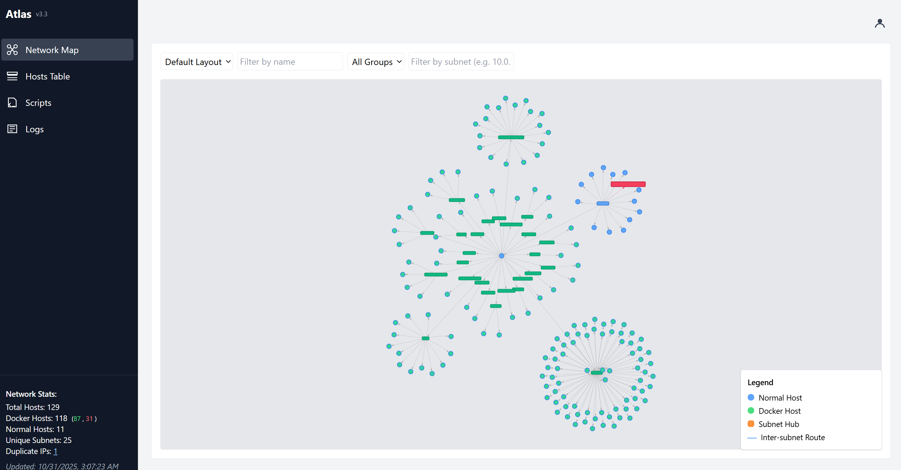
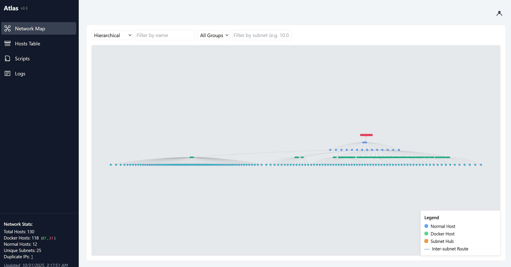
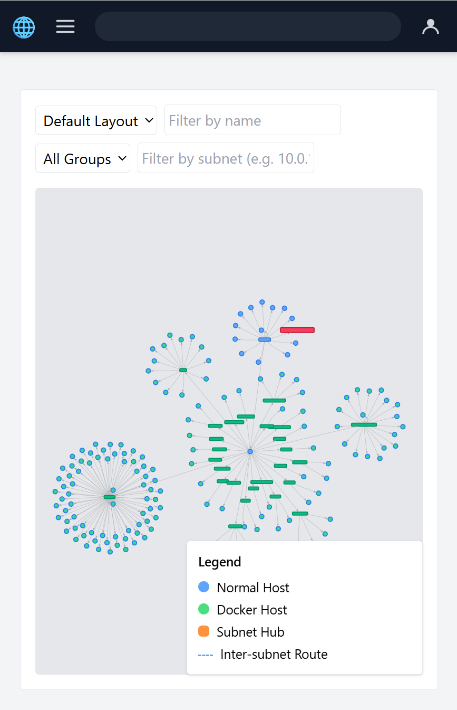
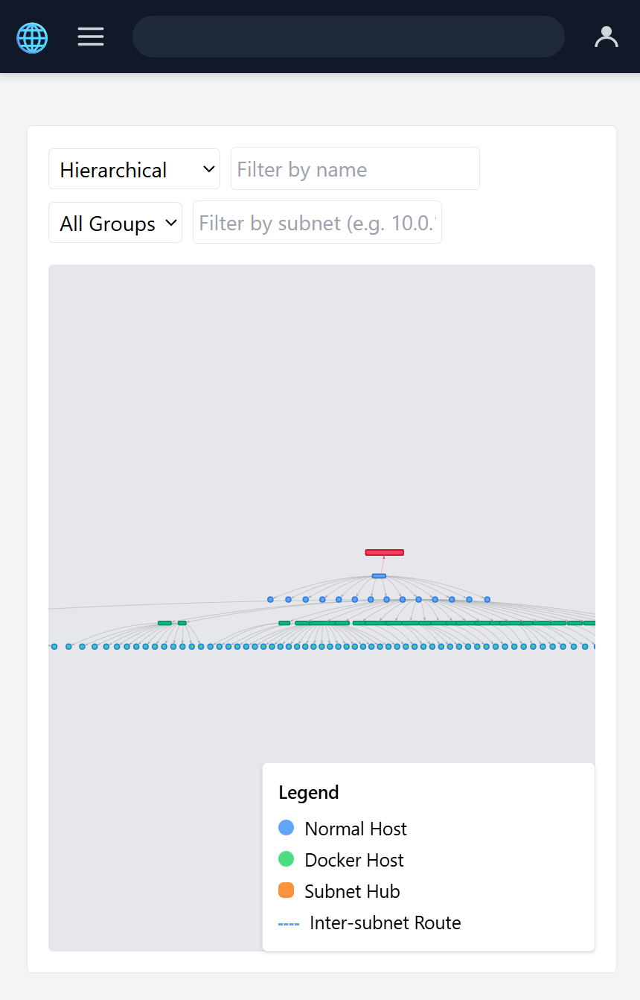
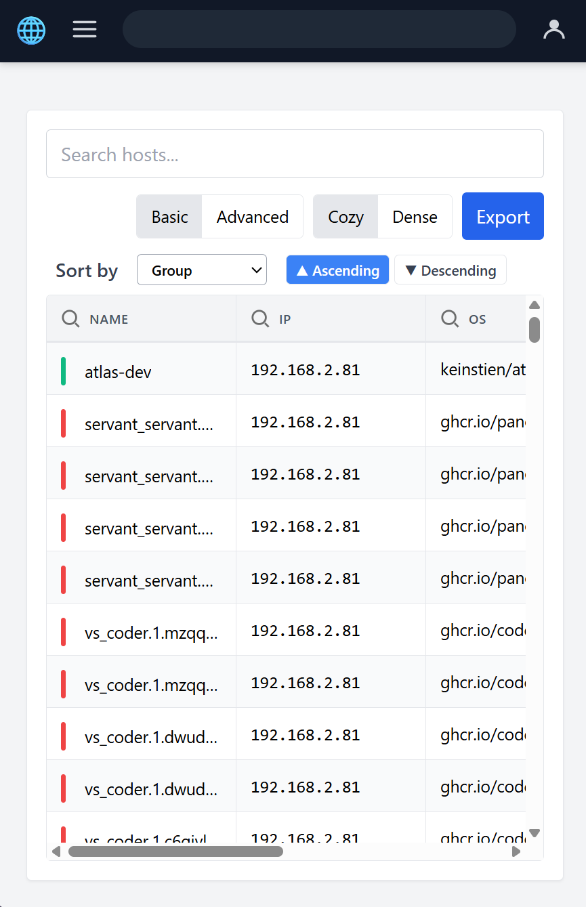

# 🌐 Atlas - Network Infrastructure Visualizer (Go-powered)

**Atlas** is a full-stack containerized tool to **scan**, **analyze**, and **visualize** network infrastructure dynamically. Built with Go, FastAPI, NGINX, and a custom React frontend, it provides automated scanning, storage, and rich dashboards for insight into your infrastructure.

---
### Live Demo 🔗 [atlasdemo.vnerd.nl](https://atlasdemo.vnerd.nl/)

---
## 🚀 What It Does

Atlas performs three key functions:

1. **Scans Docker Containers** running on the host to extract:
   - IP addresses **(supports multiple IPs per container)**
   - MAC addresses **(supports multiple MACs per container)**
   - Open ports
   - Network names
   - OS type (from image metadata)
   - **Each network interface is tracked separately**

2. **Scans Local & Neighboring Hosts** on the subnet to:
   - Detect reachable devices
   - Retrieve OS fingerprints, MACs, and open ports
   - Populate a full map of the infrastructure

3. **Visualizes Data in Real-Time**:
   - Serves an interactive HTML dashboard via Nginx
   - Hosts a FastAPI backend for data access and control
   - Uses a React frontend to render dynamic network graphs

---

## 🖼️ Screenshots

### 🖥️ Desktop View

<table>
<tr>
<td width="50%">
<a href="screenshots/dashboard_big_c.png" target="_blank">

<p align="center"><em>Dashboard - Circular Layout</em></p>
</a>
</td>
<td width="50%">
<a href="screenshots/dashboard_big_h.png" target="_blank">

<p align="center"><em>Dashboard - Hierarchical Layout</em></p>
</a>
</td>
</tr>
<tr>
<td width="50%">
<a href="screenshots/table_big.png" target="_blank">

<p align="center"><em>Hosts Table View</em></p>
</a>
</td>
<td width="50%">
<a href="screenshots/logs_big.png" target="_blank">

<p align="center"><em>Logs Panel</em></p>
</a>
</td>
</tr>
</table>

### 📱 Mobile View

<table>
<tr>
<td width="25%" align="center">
<a href="screenshots/dashboard_small_c.png" target="_blank">

<p align="center"><em>Dashboard - Collapsed</em></p>
</a>
</td>
<td width="25%" align="center">
<a href="screenshots/dashboard_small_h.png" target="_blank">

<p align="center"><em>Dashboard - Horizontal</em></p>
</a>
</td>
<td width="25%" align="center">
<a href="screenshots/table_small.png" target="_blank">

<p align="center"><em>Hosts Table</em></p>
</a>
</td>
<td width="25%" align="center">
<a href="screenshots/logs_small.png" target="_blank">

<p align="center"><em>Logs Panel</em></p>
</a>
</td>
</tr>
</table>

> 💡 **Tip:** Click on any screenshot to view the full-size image

---

## 🚀 Deployment (Docker)

Run Atlas with optional port configuration:

```bash
docker run -d \
  --name atlas \
  --network=host \
  --cap-add=NET_RAW \
  --cap-add=NET_ADMIN \
  -v /var/run/docker.sock:/var/run/docker.sock \
  -e ATLAS_UI_PORT=8884 \
  -e ATLAS_API_PORT=8885 \
  -e FASTSCAN_INTERVAL=3600 \
  -e DOCKERSCAN_INTERVAL=3600 \
  -e DEEPSCAN_INTERVAL=7200 \
  -e SCAN_SUBNETS="192.168.1.0/24,10.0.0.0/24" \
  keinstien/atlas:latest
```

**Environment Variables:**
- `ATLAS_UI_PORT` – Sets the port for the Atlas UI (Nginx). Default: 8888.
- `ATLAS_API_PORT` – Sets the port for the FastAPI backend. Default: 8889.
- `FASTSCAN_INTERVAL` – Interval in seconds between fast scans. Default: 3600 (1 hour).
- `DOCKERSCAN_INTERVAL` – Interval in seconds between Docker scans. Default: 3600 (1 hour).
- `DEEPSCAN_INTERVAL` – Interval in seconds between deep scans. Default: 7200 (2 hours).
- `SCAN_SUBNETS` – Comma-separated list of subnets to scan (e.g., "192.168.1.0/24,10.0.0.0/24"). If not set, Atlas will auto-detect the local subnet. This allows scanning multiple networks including LAN and remote servers.

If not set, defaults are used (UI: 8888, API: 8889, scan intervals as shown above).

Example endpoints:
- UI:                              http://localhost:ATLAS_UI_PORT
- API(from exposed API port):      http://localhost:ATLAS_API_PORT/api/docs
- API(based on nginx conf):        http://localhost:ATLAS_UI_PORT/api/docs

**Scan Scheduling:**
Atlas automatically runs scans at the configured intervals. You can:
- Set initial intervals via environment variables (see above)
- Change intervals dynamically through the Scripts Panel in the UI
- Manually trigger scans via the UI or API at any time

The scheduler starts automatically when the container starts and runs scans in the background.

---

## ⚙️ How it Works

### 🔹 Backend Architecture

- **Go CLI (`atlas`)**
  - Built using Go 1.22
  - Handles:
    - `initdb`: Creates SQLite DB with required schema
    - `fastscan`: Fast host scan using ARP/Nmap
    - `dockerscan`: Gathers Docker container info from `docker inspect`
    - `deepscan`: Enriches data with port scans, OS info, etc.

- **FastAPI Backend**
  - Runs on `port 8889`
  - Serves:
    - `/api/hosts` – all discovered hosts (regular + Docker)
    - `/api/external` – external IP and metadata

- **NGINX**
  - Serves frontend (React static build) on `port 8888`
  - Proxies API requests (`/api/`) to FastAPI (`localhost:8889`)

---

## 📂 Project Structure

**Source Code (Host Filesystem)**

```
atlas/
├── config/
│   ├── atlas_go/        # Go source code (main.go, scan, db)
│   ├── bin/             # Compiled Go binary (atlas)
│   ├── db/              # SQLite file created on runtime
│   ├── logs/            # Uvicorn logs
│   ├── nginx/           # default.conf for port 8888
│   └── scripts/         # startup shell scripts
├── data/
│   ├── html/            # Static files served by Nginx
│   └── react-ui/        # Frontend source (React)
├── Dockerfile
├── LICENSE
└── README.md
```

**Inside Container (/config)**
```
/config/
├── bin/atlas             # Go binary entrypoint
├── db/atlas.db           # Persistent SQLite3 DB
├── logs/                 # Logs for FastAPI
├── nginx/default.conf    # Nginx config
└── scripts/atlas_check.sh # Entrypoint shell script

```

---

## 🧪 React Frontend (Dev Instructions)

This is a new React-based UI.

### 🛠️ Setup and Build

```bash
cd /swarm/data/atlas/react-ui
npm install
npm run build
```

The built output will be in:
```
/swarm/data/atlas/react-ui/dist/
```

For development CI/CD (for UI and backend anf build a new docker version):
```bash
/swarm/github-repos/atlas/deploy.sh
```


## 🚀 CI/CD: Build and Publish a New Atlas Docker Image

To deploy a new version and upload it to Docker Hub, use the provided CI/CD script:

1. Build and publish a new image:

   ```bash
   /swarm/github-repos/atlas/deploy.sh
   ```

   - The script will prompt you for a version tag (e.g. `v3.2`).
   - It will build the React frontend, copy to NGINX, build the Docker image, and push **both** `keinstien/atlas:$VERSION` and `keinstien/atlas:latest` to Docker Hub.

2. Why push both tags?

   - **Version tag:** Allows you to pin deployments to a specific release (e.g. `keinstien/atlas:v3.2`).
   - **Latest tag:** Users can always pull the most recent stable build via `docker pull keinstien/atlas:latest`.

3. The script will also redeploy the running container with the new version.

**Example output:**
```shell
🔄 Tagging Docker image as latest
📤 Pushing Docker image to Docker Hub...
✅ Deployment complete for version: v3.2
```

> **Note:** Make sure you are logged in to Docker Hub (`docker login`) before running the script.


---

## 🌍 URLs

- **Swagger API docs:**
  - `🌍 http://localhost:8888/api/docs` (Host Data API endpoint)

- **Frontend UI:**
  - `🖥️ UI	http://localhost:8888/` (main dashboard)
  - `📊 http://localhost:8888/hosts.html` (Hosts Table)
  - `🧪 http://localhost:8888/visuals/vis.js_node_legends.html` (legacy test UI)

> Default exposed port is: `8888`

### 📡 Scheduler API Endpoints

New scheduler management endpoints:

- `GET /api/scheduler/intervals` - Get current scan intervals for all scan types
- `PUT /api/scheduler/intervals/{scan_type}` - Update interval for a specific scan type (fastscan, dockerscan, or deepscan)
- `GET /api/scheduler/status` - Get scheduler status and current intervals

Example:
```bash
# Get current intervals
curl http://localhost:8888/api/scheduler/intervals

# Update fastscan interval to 30 minutes (1800 seconds)
curl -X PUT http://localhost:8888/api/scheduler/intervals/fastscan \
  -H "Content-Type: application/json" \
  -d '{"interval": 1800}'

# Check scheduler status
curl http://localhost:8888/api/scheduler/status
```

---

## ✅ Features

- [x] **Multi-interface scanning** - Automatically detects and scans all physical network interfaces on the host
- [x] Fast network scans (ping/ARP)
- [x] **Multiple subnet scanning** - Scan your LAN, remote servers, and multiple networks simultaneously via SCAN_SUBNETS environment variable
- [x] Docker container inspection with **multi-network support**
- [x] **Multiple IPs and MACs per container** - Containers on multiple networks show all interfaces
- [x] **Interface-aware host tracking** - Same host on multiple interfaces appears separately with interface labels
- [x] External IP discovery
- [x] Deep port scans with OS enrichment
- [x] React-based dynamic frontend
- [x] NGINX + FastAPI routing
- [x] SQLite persistence
- [x] **Scheduled auto scans with configurable intervals** - Configure via environment variables or UI
- [x] **Dynamic interval management** - Change scan intervals without restarting the container

---

## 📌 Dev Tips

To edit Go logic:
- Main binary: `internal/scan/`
- Commands exposed via: `main.go`

To edit API:
- Python FastAPI app: `scripts/app.py`

To edit UI:
- Modify React app under `/react-ui`
- Rebuild and copy static files to `/html`
- _automated deplolyment and publish to dockerhub using the script deploy.sh_
---

## ⚙️ Automation Notes
- Atlas runs automatically on container start.

- All Go scan tasks run sequentially:
   - `initdb → fastscan → deepscan → dockerscan`

- Scheduled scans are run every 30 minutes via Go timers.

- No cron dependency required inside the container.

- Scans can also be manually triggered via the UI using API post request.
---
## 👨‍💻 Author

**Karam Ajaj**  
Infrastructure & Automation Engineer  
[https://github.com/karam-ajaj](https://github.com/karam-ajaj)

---

## 📝 License

MIT License — free for personal or commercial use.

---

## 📚 Documentation

- [Multi-Interface Support](MULTI_INTERFACE_SUPPORT.md) - Detailed guide on the multi-interface scanning feature
- [Migration Guide](MIGRATION_GUIDE.md) - Guide for migrating from bash scripts to Go implementation

## 🤝 Contributing

Suggestions, bug reports, and pull requests are welcome!

## Star History

[](https://www.star-history.com/#karam-ajaj/atlas&type=date&legend=top-left)
